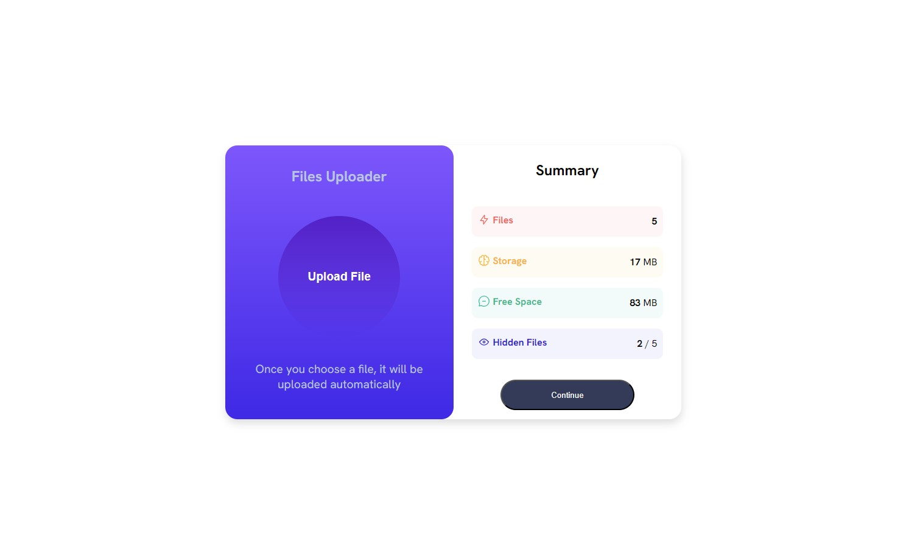

# Front-end Style Guide

## Desktop View

## Colors

### Primary

- Light red (Files): hsl(0, 100%, 67%) 
- Orangey yellow (Storage): hsl(39, 100%, 56%)
- Green teal (Free Space): hsl(166, 100%, 37%)
- Cobalt blue (Hidden Files): hsl(234, 85%, 45%)

### Backgrounds
- Light red (Files): #fef5f6
- Light yellow (Storage): #fffbf2
- Light green (Free Space): #f2fbfa
- Light purple (Hidden Files): #f3f3fd

## Gradients

- Light slate blue (left background): hsl(252, 100%, 67%)
- Light royal blue (left background): hsl(241, 81%, 54%)

- Violet blue (circle): hsla(256, 72%, 46%, 1)
- Persian blue (circle): hsla(241, 72%, 46%, 0)

### Box-Shadow
- 1px 7px 14px #dedede 

### Font
- Family: [Hanken Grotesk](https://fonts.google.com/specimen/Hanken+Grotesk)
